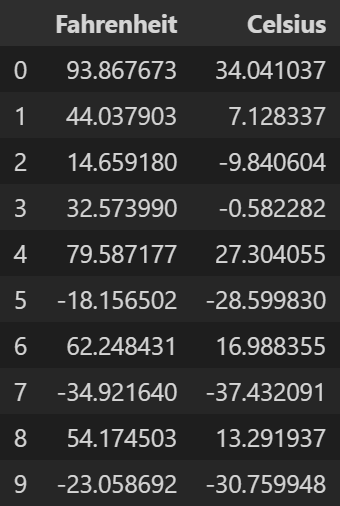
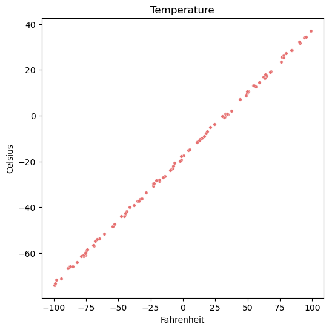
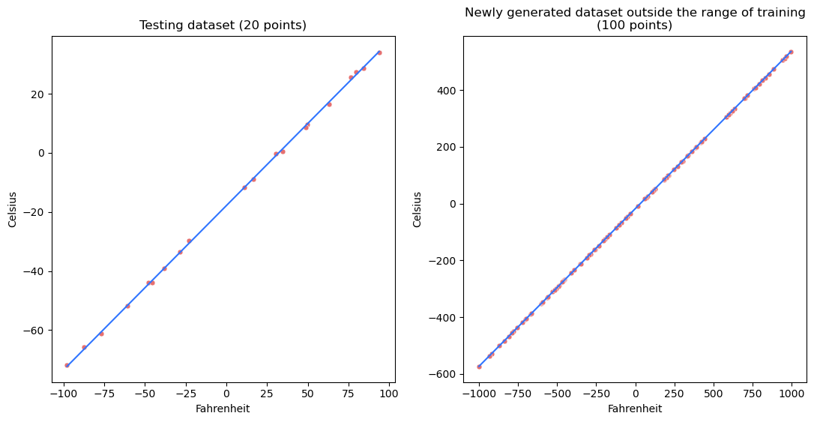

# Temperature Prediction

Temperature prediction project for Python 3.10.11 (conda)

## Applications

* [Miniconda](https://docs.conda.io/en/latest/miniconda.html "Miniconda download")
* [Visual Studio Code](https://code.visualstudio.com/download "Visual Studio Code download")
* [Jupyter Iteractive Extension for Visual Studio Code](https://marketplace.visualstudio.com/items?itemName=ms-toolsai.jupyter "Jupyter Extension for Visual Studio Code installation page")
* [ipykernel](https://pypi.org/project/ipykernel/ "ipykernel for Jupyter")
* [Jupyter Notebook](https://jupyter.org/ "Jupyter Notebook download")
* [CUDA Toolkit 11.7](https://developer.nvidia.com/cuda-11-7-0-download-archive?target_os=Windows&target_arch=x86_64&target_version=10 "CUDA Toolkit 11.7 for Windows")
* `conda install pytorch torchvision torchaudio pytorch-cuda=11.7 -c pytorch -c nvidia`

## Required Libraries

* [Matplotlib](https://matplotlib.org/)
* [NumPy](https://numpy.org/)
* [pandas](https://pandas.pydata.org/)
* [seaborn](https://seaborn.pydata.org/)
* [PyTorch](https://pytorch.org/)
* [scikit-learn](https://scikit-learn.org/stable/)

## Credits

Alex Akoopie - Creator

# Analysis

## Using PyTorch

### Without Standardization

First, we will use PyTorch to predict the temperature in celsius given the temperature in fahrenheit. Here is a sample of what the data looks like:



This is what the data looks like when we plot it:



It is not a perfect line because a random number between -1 and 1 is added to the final value for each data point. This is to simulate real world data, as there will be random noise whenever we measure data.

This is what the model came up with for its weight and bias after training it on 80% of the data:

```
Weight:	  0.55592572689056396484
Bias:	-17.87423515319824218750
```

In actuality, it should be 0.5556 for the weight and -17.7778 for the bias.

Testing set statistics:

```
Median:	0.5420902432861361
Mean:	0.4995663666654872
STD:	0.30286413761328884
```

New set statistics:

```
Median:	0.18417075399136706
Mean:	0.18699610017609777
STD:	0.12226472007921732
```

Comparison graph between the testing dataset and the newly generated dataset along with the model's prediction lines:


