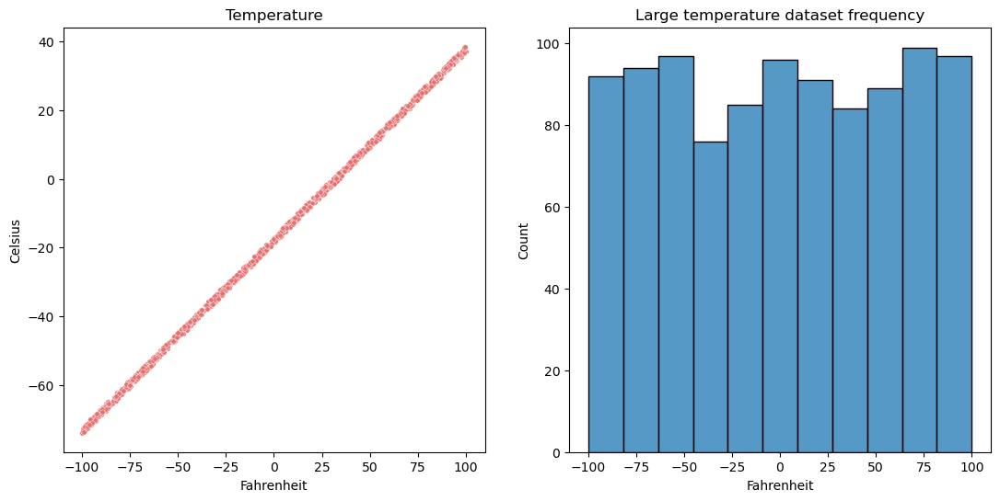

# Temperature Prediction

Temperature prediction project for Python 3.10.11 (conda)

## Applications

* [Miniconda](https://docs.conda.io/en/latest/miniconda.html "Miniconda download")
* [Visual Studio Code](https://code.visualstudio.com/download "Visual Studio Code download")
* [Jupyter Iteractive Extension for Visual Studio Code](https://marketplace.visualstudio.com/items?itemName=ms-toolsai.jupyter "Jupyter Extension for Visual Studio Code installation page")
* [ipykernel](https://pypi.org/project/ipykernel/ "ipykernel for Jupyter")
* [Jupyter Notebook](https://jupyter.org/ "Jupyter Notebook download")
* [CUDA Toolkit 11.7](https://developer.nvidia.com/cuda-11-7-0-download-archive?target_os=Windows&target_arch=x86_64&target_version=10 "CUDA Toolkit 11.7 for Windows")
* `conda install pytorch torchvision torchaudio pytorch-cuda=11.7 -c pytorch -c nvidia`

## Required Libraries

* [Matplotlib](https://matplotlib.org/)
* [NumPy](https://numpy.org/)
* [pandas](https://pandas.pydata.org/)
* [seaborn](https://seaborn.pydata.org/)
* [PyTorch](https://pytorch.org/)
* [scikit-learn](https://scikit-learn.org/stable/)

## Credits

Alex Akoopie - Creator

# Analysis

## Using PyTorch

### Without Standardization

First, we will use PyTorch to predict the temperature in celsius given the temperature in fahrenheit. Here is a sample of what the data looks like:


This is what the data looks like when we plot it:


It is not a perfect line because a random number between -1 and 1 is added to the final value for each data point. This is to simulate real world data, as there will be random noise whenever we measure data.

This is what the model came up with for its weight and bias after training it on 80% of the data:

```
Weight:	  0.55592572689056396484
Bias:	-17.87423515319824218750
```

In actuality, it should be 0.5556 for the weight and -17.7778 for the bias.

Testing set statistics:

```
Median:	0.5420902432861361
Mean:	0.4995663666654872
STD:	0.30286413761328884
```

New set statistics:

```
Median:	0.18417075399136706
Mean:	0.18699610017609777
STD:	0.12226472007921732
```

Comparison graph between the testing dataset and the newly generated dataset along with the model's prediction lines:


### With Standardization

The weight and bias are less accurate.

```
Weight:	 0.54834318161010742188
Bias:	-0.35831752419471740723
```

Testing set statistics:

```
Median:	0.04252241135784722
Mean:	0.0439516899458269
STD:	0.010775552540253744
```

New set statistics:
```
Median:	18.923420638063547
Mean:	18.33950259533176
STD:	4.262082403826034
```

Comparison graph shows that standardizing misaligns the actual values with the model's prediction lines:


Standardizing the newly generated dataset:


Large dataset plotted and frequency analysis (size 1000 by 2):



Testing set statistics:
```
Median:	0.009812493830032909
Mean:	0.009402428856013922
STD:	0.00464084235334736
```

New set statistics:
```
Median:	17.48263506677752
Mean:	17.47574094805168
STD:	0.14660834836776673
```

Comparison graph of standardized large dataset:


Final evaluation metrics:
```
Mean Absolute Error:	17.47574094805168
Mean Squared Error:     305.42301569122145
R-squared:              0.9999706724644422
```

## Using scikit-learn

### Without Standardization

Next, we will be using sklearn to do the same thing to see if we get different results. Sklearn is generally much easier to use due to the high level of abstraction in the library.

Training set statistics:
```
Median:	0.5257791703289891
Mean:	0.49864511359746383
STD:	0.2834380323055753
```

Testing set statistics:
```
Median:	0.5430821469365608
Mean:	0.5291101431101558
STD:	0.27300236693546803
```

New set statistics:
```
Median:	1.658569718874105
Mean:	1.8602371792038384
STD:	0.9281894159860847
```
Comparison graph between the testing dataset and the newly generated dataset along with the model's prediction lines:


### With Standardization

Standardizing the data allows the model to perform better.

Training set statistics:
```
Median:	0.008636979574751291
Mean:	0.00861336076640391
STD:	0.005140659530277195
```

Testing set statistics:
```
Median:	0.009442688888481942
Mean:	0.009495070091505572
STD:	0.004403469653703121
```

New set statistics:
```
Median:	0.017212608888289793
Mean:	0.022001713736242056
STD:	0.016464719702329236
```

Comparison graph shows that standardizing misaligns the actual values with the model's prediction lines:


Final evaluation metrics:
```
Mean Absolute Error:	0.022001713736242056
Mean Squared Error:	    0.0007551624022078109
R-squared:		        0.9999997003632581
```
